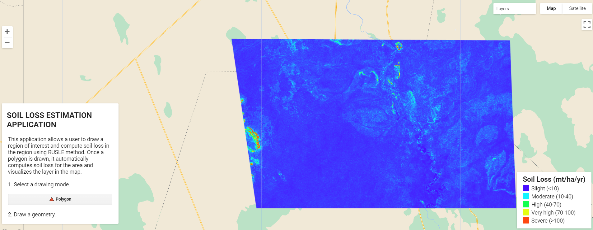

This application allows a user to estimate soil loss of a region per year using RUSLE method. The user draws a region of interest and the app computes soil loss and visualizes the layer in the map. The factors considered in soil loss estimation are rainfall erositvity, soil erodibility, slope length steepness, cover and management and erosion management.
Link to [App](https://ee-kimeu.projects.earthengine.app/view/soil-erosion-estimation)

