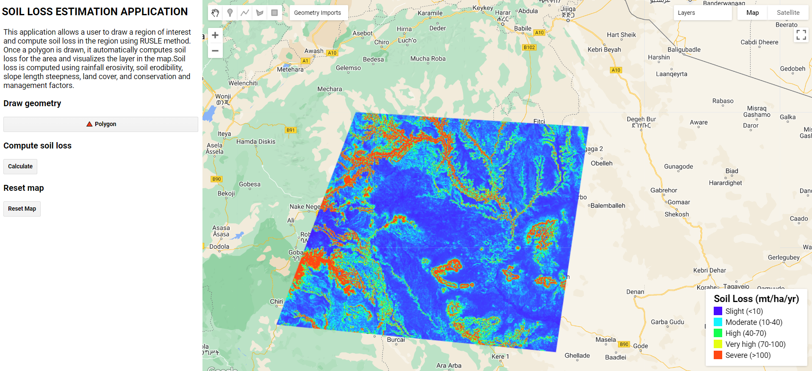

An interactive Earth Engine application enabling users to estimate annual soil loss for any region using the RUSLE method. Integrating rainfall erosivity, soil erodibility, slope, land cover, and erosion management factors, the tool supports land degradation assessment and natural resource management planning.

Link to [App](https://ee-kimeu.projects.earthengine.app/view/soil-erosion-estimation)
