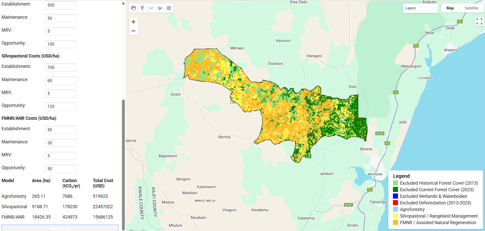

This tool was developed to support decision-making for the Restore Africa Project by helping users identify suitable sites for agroforestry, silvopastoral, rangeland management, and assisted natural regeneration (FMNR) interventions across project areas in East and Southern Africa. By integrating multiple datasets — including land cover, land use, conservation zones, and deforestation trends — the tool provides a comprehensive assessment of site suitability, restoration potential, and intervention prioritization.

It enables partners and stakeholders to generate actionable outputs that inform planning, collaboration, funding, and implementation. These outputs include:
 - Maps of priority intervention sites and most suitable areas for different restoration interventions (agroforestry, silvopastoral systems,
   FMNR/assisted natural regeneration),
 - Estimates of implementable area,
 - Projected carbon mitigation potential, and
 - Net Present Value (NPV) of implementation costs, accounting for establishment, maintenance, MRV, and opportunity costs over the project period.

The tool provides a foundation for guiding subsequent project activities, including stakeholder engagement to validate and refine priorities, as well as the preparation of context-specific, strategically targeted land-use action plans.
Link to [App](https://kimeu.users.earthengine.app/view/resaf-decision-support-tool)
