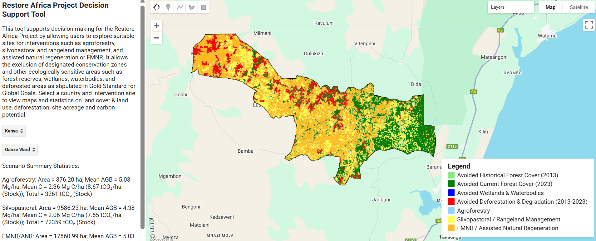

The ResAF Project Decision Support Tool (DST) is designed to streamline spatial planning and evidence-based decision-making for landscape restoration and sustainable land management. By integrating multiple datasets — ranging from land cover, land use, and conservation zones to deforestation trends — the tool provides a comprehensive assessment of site suitability, restoration potential, and intervention prioritization.
The DST allows teams to generate outputs that can inform planning, collaboration, funding, and implementation. These outputs include maps of priority intervention sites, most suitable areas for interventions, estimates of implementable area, and projected carbon mitigation potential.
This tool serves as a foundation for guiding the next steps in the project, including stakeholder engagement to validate and refine priorities, as well as the preparation of land-use action plans that are both context-specific and strategically targeted.
Link to [App]()
