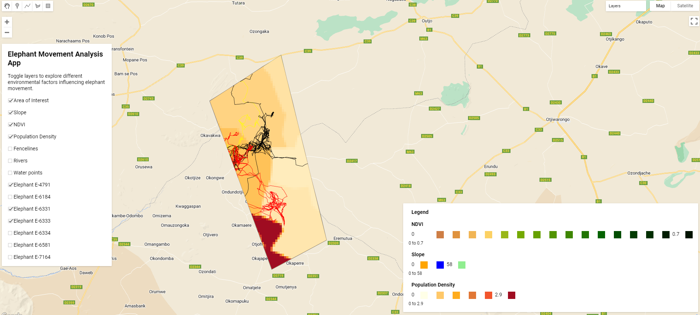

This application enables users to interact with various datasets that influence the movement of African Elephants in the Kunene and Erongo regions of Namibia. By exploring layers such as topography (slope), NDVI (vegetation health), rivers, fencelines, population density, water points, and elephant telemetry (collar) data, users can deduce the factors that drive elephant movement patterns across the landscape.

Link to [App](https://kimeu.users.earthengine.app/view/elephant-movement)
