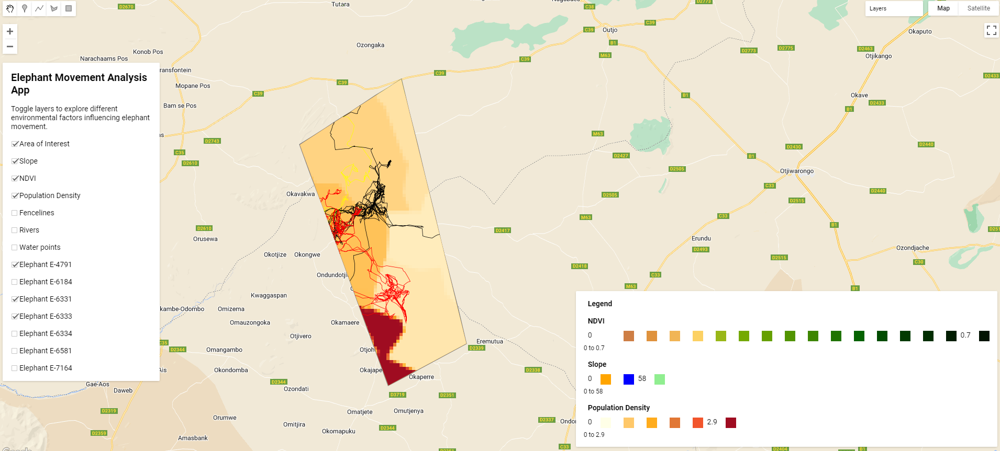

An interactive Earth Engine application enabling users to explore the geospatial factors driving African elephant movement across the Kunene and Erongo regions of Namibia. Integrating topography, vegetation health, water points, population density, fencelines, and GPS collar telemetry, the tool supports wildlife corridor design and human-elephant conflict mitigation for the Elephant-Human Relations Aid (EHRA) organization.

Link to [App](https://kimeu.users.earthengine.app/view/elephant-movement)
