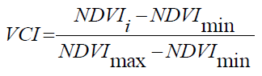
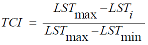
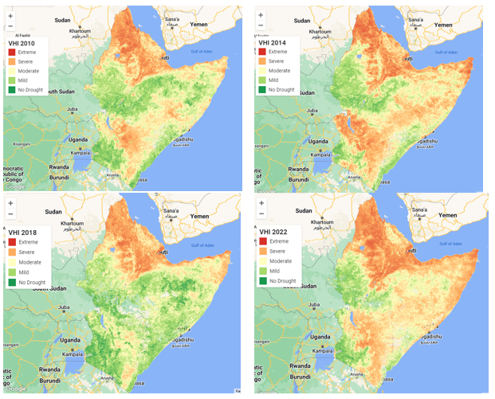

## Introduction
Food insecurity and environmental degradation challenges have necessitated the need to study drought impacts in the world. In the horn of Africa, the last 6 years have experienced severe to extreme drought conditions due to the changing climatic conditions. This has had a huge impact on food and water availability leaving millions of people and livestock in danger of starvation. Various studies focusing on factors that greatly influence drought conditions such as rainfall, temperature and soil moisture have been done to examine and monitor the droughts in the region. Remote sensing time series data such as MODIS rainfall, NDVI and land surface temperature can be used to study the evolution of drought and inform decision makers on the necessary actions to take.

## Methodology
In this project, I analysed MODIS Normalized Difference Vegetation Index (NDVI) and Land Surface Temperature (LST) datasets to assess vegetation health using the Vegetation Health Index (VHI) in the region from 2010 to 2022 for long rains season between March and June every year. VHI is computed using Vegetation Condition Index (VCI) and Temperature Condition Index (TCI). VCI and TCI formulas are shown below.

  
  
  

## Results
The year 2022 experienced severe to extreme drought in almost all countries in the region. Eritrea, Djibouti, Somalia, North-Eastern Kenya and Ethiopia have been experiencing prolonged drought during the long rains season.

## Conclusion
This information is quite useful to stakeholders, partners, farmers, and governments in tackling food insecurity and vegetation loss in the wake of climate change.

Source: <a href="https://github.com/japhethkimeu/droughtmonitoring"><i class="large github icon"></i>droughtmonitoring</a>

