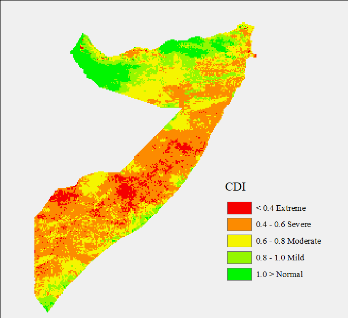

  
  
  
  

There are various indices used in drought monitoring; precipitation index, temperature index, vegetation index, and sometimes soil moisture index. In this work, I computed combined drought index  (cdi) using the two commonly used indices, precipitation index (pdi) and temperature index (tdi). I modelled cdi as a sum function of pdi and tdi i.e. cdi=0.7pdi+0.3tdi. With availability of soil moisture index, cdi is computed as the sum of the three indices with precipitation taking 50% while temperature and soil moisture take 25% each. I used time series chirps rainfall data and MODIS land surface temperature data in Google Earth Engine to compute the two indices for the year 2010 from January to December. I then computed the combined drought index in GIS software. 

Results show that almost half of the year 2010 Somalia experienced prolonged drought with October, November, and December months experiencing severe to extreme drought while January, February and march experienced moderate to severe drought. 

Source: <a href="https://github.com/japhethkimeu/droughtmonitoring"><i class="large github icon"></i>droughtmonitoring</a>

More about combined drought index [here](https://cdi.faoswalim.org/uploads/CDI-Manual.pdf).

