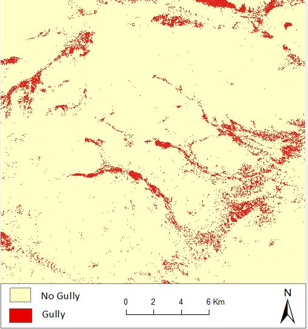

The United Nations Convention to Combat Desertification (UNCCD) estimates that two thirds of productive land in Africa is degraded (UNCCD 2013). Soil degradation is one of the major forms of land degradation and occurs through water erosion, wind erosion, chemical and physical deterioration. According to Jones et al. (2013), water erosion accounts for forty six percent of land degradation in sub-Saharan Africa. In most tropical regions of Africa, water erosion is accelerated by deforestation, population increase, and flooding due to heavy rainfall incidents. Water erosion manifests in various forms; sheet, rill and gully erosions. Sheet erosion occurs through surface run-off washing away considerable amount of nutrients from top soil thereby rendering it unproductive. In cases where massive water quantities flow down susceptible sloping and gentle terrain, rill and gully erosion occurs. Gully erosion is the most destructive form of soil erosion since it can remove and transport huge quantities of soil (Daba, Rieger, and Strauss 2003).
Machine-learning algorithms have become common in remote sensing tasks such as image classification. I carried out a binary classification (i.e. gully and no gully) of satellite imagery using Random Forest and Support Vector Machines. Random forest is an ensemble learning algorithm based on the idea that a combination of bootstrap aggregated classifiers perform better than a single classifier (Breiman 2001). The bootstrap component means that each individual tree is parameterized using a randomly sampled set of observations with replacement from the training data (Hastie, Tibshirani, and Friedman 2009). Support Vector Machines were introduced by (Vapnik 1982). SVM algorithm finds the optimum minimization, i.e. decision boundary, of ambiguous classifier outputs in a problem space. This decision boundary is referred to as the hyperplane and it distinguishes the classification problem into a predefined set of classes that are consistent with the training data. The algorithm undergoes an iterative process of finding the optimum hyperplane boundary in an n-dimensional classification space to distinguish patterns in the training data then apply the same configuration to a separate evaluation dataset.
The data required for the study includes satellite imagery and reference data. I downloaded Sentinel 2 imagery from https://scihub.copernicus.eu/dhus/#/home. The images were S2 Level 1C TOA processing format and not corrected of atmospheric effects. I used SNAP Sen2Cor to correct atmospheric effects and get S2 Level 2A BOA. Training and validation samples were digitized in a GIS environment.

Source: <a href="https://github.com/japhethkimeu/gully_feature_mapping"><i class="large github icon"></i>gully_feature_mapping</a>

