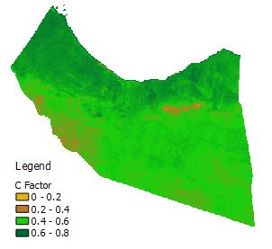
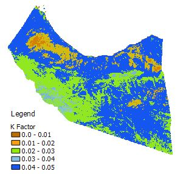
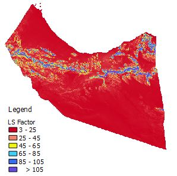
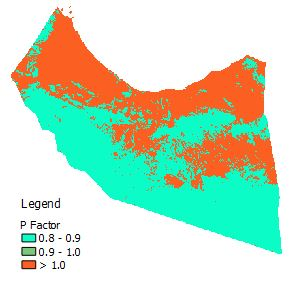
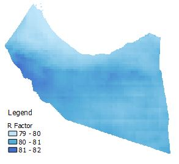
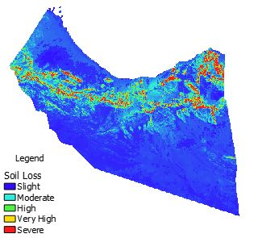

---

  

  

---
---

  

  

---
---

  

  

---

Revised Universal Soil Loss Equation (RUSLE) developed by Renard et al. (1996) is one of the methods used in estimating soil loss. In this project, I implemented RUSLE in GEE to estimate annual soil loss in North-Western Somalia. RUSLE is described by A = R * K * LS * C * P, where, A is the mean annual soil loss in metric tonnes/ha/year, R is rainfall erosivity factor, K is soil erodibility factor, LS is slope length-steepness factor, C is cover and management factor and P is erosion management factor. More about RUSLE https://handle.nal.usda.gov/10113/11126

Source: <a href="https://github.com/japhethkimeu/soil_loss_estimation"><i class="large github icon "></i>soil_loss_assessment</a>

