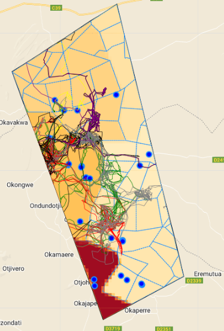

This project aims to identify the factors motivating the movement of African Elephants in Kunene and Erongo regions of Namibia using various geospatial data. The data includes
- Topography (slope)
- NDVI as a proxy for vegetation health
- Rivers
- Fencelines
- Population density
- Water points
- Elephant telemetry (collar) data

The Elephant-Human Relations Aid (EHRA) organization, based in Namibia, is dedicated to mitigating human-elephant conflicts and fostering peaceful coexistence between humans and elephants. Their current initiative focuses on delineating a wildlife corridor to alleviate issues caused by elephants straying into commercial farms in search of food and water.
EHRA was recognized as one of the winners of the Satellite for Biodiversity Awards 2023, a program run by the Connected Conservation Foundation in collaboration with the Airbus Foundation. As part of this award, Airbus provided very high-resolution (VHR) Pleiades satellite imagery to all winners.
In this project, I conducted a Land Use and Land Cover (LULC) analysis using 30cm Pleiades Neo imagery along with elephant collar data provided by EHRA. The analysis was performed in Google Earth Engine, integrating these data with other geospatial datasets to explore and understand elephant movement patterns within the study area. This work aims to support the creation of effective wildlife corridors and contribute to reducing human-wildlife conflict in the region.

Based on the analysis, the movement of elephants across the landscape was primarily influenced by the availability of water sources and the presence of vegetation. Between January and April 2024, the elephants frequently visited specific water points in the study area, demonstrating their reliance on these sources for hydration. Additionally, the Normalized Difference Vegetation Index (NDVI) analysis revealed that the elephants were attracted to areas with healthy vegetation, particularly along river channels where lush growth was prevalent.

The analysis also showed that the terrain played a significant role in their movement patterns. Elephants tended to avoid steep slopes, with 90% of their movements occurring in gentler areas. High population density and deep areas along rivers were other factors that the elephants avoided. Furthermore, the presence of fences was a notable restriction on their movement, although in some instances, the elephants breached commercial farms by damaging the fences.

EHRA plans to use these insights to establish a wildlife corridor in the area. This corridor will aim to mitigate conflicts by reducing incidents of elephants destroying fences, crops, and structures, and to decrease the frequency of farmers taking extreme measures against straying animals. By addressing these challenges, EHRA seeks to enhance coexistence between elephants and local communities.
Source: <a href="https://github.com/japhethkimeu/elephant-movement"><i class="large github icon"></i>elephant-movement</a>
