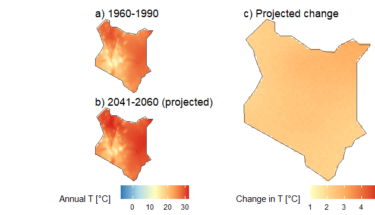

Intergovernmental Panel on Climate Change (IPCC) Assessment published observed and projected data on climate with a high temporal coverage. The data consists of various weather and climate elements including temperature, precipitation, humidity, air pressure, etc. In this work, I will be analysing the various datasets to show current and future scenarios using R programming. The data is available at https://worldclim.org/ and https://esgf-node.llnl.gov/projects/cmip5/ (CMIP5 models).
Currently I am working on the following:
- Temperature
- Precipitation
Based on the data, the Kenya and the world at large is expected to be hotter by 2-3 degrees celsius by the year 2050.
Source: <a href="https://github.com/japhethkimeu/climate_analysis"><i class="large github icon"></i>climate_analysis</a>

