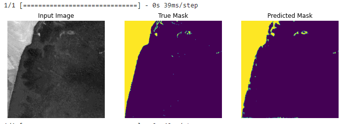

## Introduction
Deforestation is one of the major contributing factor to climate change. Vegetation loss has led to changing climatic conditions that have been witnessed all over the world. In Brazil, it’s estimated that over 500,000 square kilometres of natural vegetation have been cut down in the last 50 years. Serious interventions are needed to curb this trend. Satellite imagery analysis is one of the ways we can detect and monitor deforestation. In this project, I have analysed Sentinel-2 imagery of three regions in the State of MatoGrosso in Brazil and derived image chips using ArcGIS Pro to train a deep learning (CNN) model to detect deforestation.

## Requirements
        - tensorflow
        - keras
        - numpy
        - matplotlib
        - pandas
        - cv2
        
## Methodology
I analysed Sentinel-2 images (cloud free) of three different regions in the State of Mato Grosso in Brazil and derived a total of 5,122 image chips and masks of size ***256 * 256***. The dataset was sampled into training and validation. Data augmentation was used where the images were flipped before being fed to the network for training. I used a U-Net model that consisted of encoder and decoder. The feature extraction/encoder was implemented using MobileNetV2 with pre-trained weights to enable earning of robust features and reduce trainable parameters. The decoder consisted of 4 layers and a final prediction layer with sigmoid activation.

More on Unet model [U-Net: Convolutional Networks for Biomedical Image Segmentation](https://lmb.informatik.uni-freiburg.de/people/ronneber/u-net/)

## Training
The model was trained first using the pre-trained weights of the base model for 15 epochs with early stopping. The best result was achieved by re-training the whole model for 20 epochs and attained a binary accuracy of 0.9780.
        
## Results
The model prediction accuracy was 0.912. The accuracy can be improved by using other annotation methods to improve the quality of masks.

## Conclusion
Remote sensing data and deep learning models such as Convolutional Neural Networks can effectively map and detect deforestation. This can be used by stakeholders and agencies to control and monitor environmental degradation practices such as deforestation.

Source: <a href="https://github.com/japhethkimeu/deep_learning"><i class="large github icon"></i>deforestation</a>

