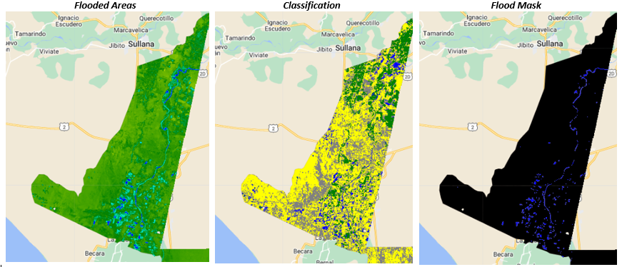

## Introduction
Flooding in South America has increased in the last decade due to changing climatic conditions. In Peru, El Nino like conditions of heavy rainfall have been witnessed recently. In March 2021, severe flooding damaged more than 3000 homes killing dozens of people in various provinces. In this project, I apply the modified normalized difference water index on sentinel 2 imagery to detect flooding in Piura Province, Peru. I also carry out an indepth assessment of the damage caused by the floods to people and crops. 

## Methodology
Sentinel-2 images of the study area were used in this study. Before and after flood images were analysed in Google Earth Engine and used to compute the modified normalized water index. Population data was obtained from Global Human Settlement Layer (GHSL) while land cover and land use data was obtained from MODIS/ESA. The data was analsed as follows;
* Computing _MNDWI_ using S2 imagery and threshold to obtain a flood mask
* Determine flood extent from flood mask
* Determine population affected using flood mask & GHSL population layer
* Compute cropland affected using flood mask & cropland layer

 
 
## Results
Agricultural areas were the most affected with over 877 hectares of cropland covered by flood water. More than 16,000 people were displaced and their houses damaged by the floods.

source: <a href="https://github.com/japhethkimeu/flood_analysis"><i class="large github icon"></i>flood analysis</a>

