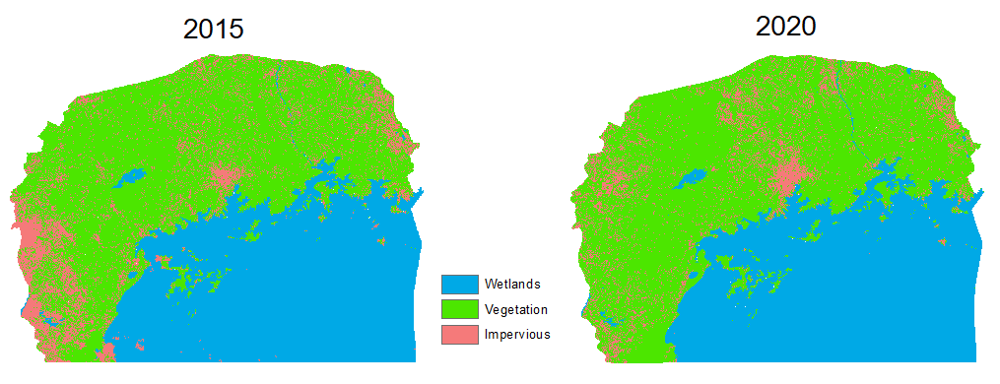

Lake Victoria wetlands have faced a myriad of threats arising from human activities such as pollution, overfishing, encroachment by people for agricultural activities and settlement. Wetlands provide food, water for human consumption and agriculture, provide a home to various animals and bird species that contribute to a rich biodiversity, and also play vital ecological functions such as flood mitigation and water purification. In Uganda, there has been efforts to protect and restore degraded wetlands through enforcement of wetland management policies and engaging relevant stakeholders. Availability of information on wetland changes is vital in making decisions and deliberating on ways of mitigating the loss of these vital ecosystems.

In this work, I detect changes in wetland ecosystems in the Lake Victoria basin in Uganda using Landsat timeseries satellite imagery of 2015 and 2020.

Results show that  hectares of wetlands were converted to urban between 2015 and 2020. 
 

Source: <a href="https://github.com/japhethkimeu/wetlands-change-detection"><i class="large github icon"></i>Wetlands change detection</a>

