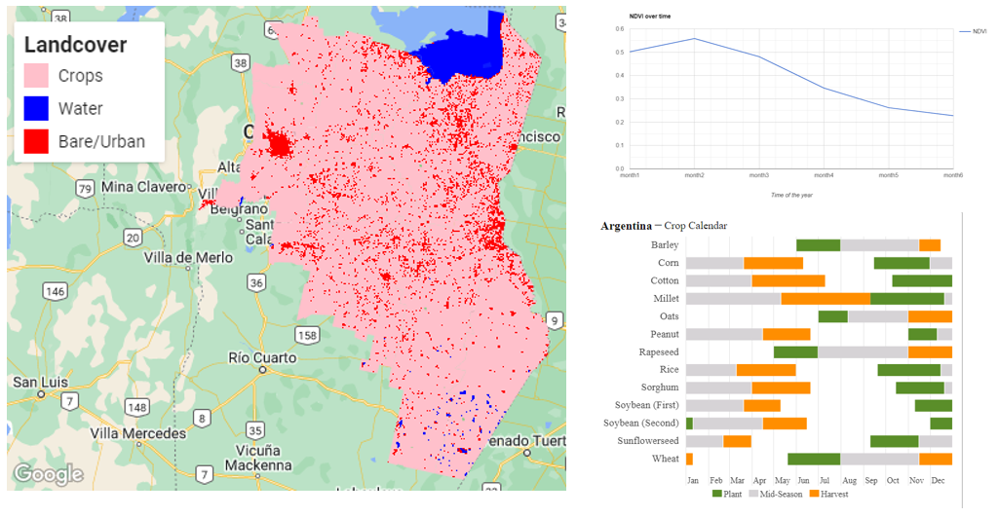
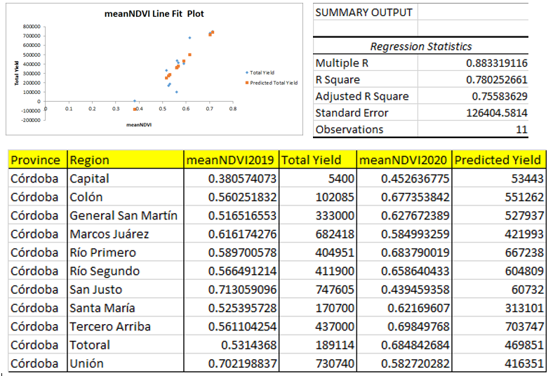

## Introduction
Crop production data such as acreage of planted crops and yield is important to government, stakeholders and farmers as it provides a basis of effective decision-making in the agriculture sector. Traditional methods of acquiring crop production data are tedious since they include extensive travel and various interpolation methods based on the sample taken. In most countries, government agencies and departments in the agriculture sector involve field officers in collecting these data through field visits to farmers and farms where they inquire about crop acreage and yield. Apart from being cumbersome, cost effective and lengthy, these methods are also too generalized and can't be fully relied upon.
Remote sensing data available throughout the year can be used to estimate acreage and yield in a short time and with a high accuracy. Several studies have proved that crop yield is directly related to NDVI. The comparison of NDVI values of various crops for one year to another gives the quantitative value by which the yield value can differ from one year to another. In this project, I used remote sensing derived data to estimate crop production (planted area and yield) of selected crops i.e. Soybean, Maize, Millet and Peanut in Cordoba region, Argentina. I analyzed ground truth data from the Ministry of Agriculture, Livestock and Fisheries for the year 2019 (Link https://datos.magyp.gob.ar/dataset).

## Methodology
According to the crop calendar for the 2019/2020 season in Argentina, planting begins in late September to late December, between January and mid-April is the growth/vegetative stage of most crops grown in the region. Most crops are harvested starting early April. I analysed Sentinel 2 images for the season to determine the NDVI for each crop growth stage. According to the chart, NDVI values are low between September - December and high between January - March. The maximum values are in mid-February before they start going down in mid-March as the crop nears maturity. Using this information, I used a Sentinel 2 image of the region for the period January - March 2020 and;
* Classified the image and computed area for each class.
* Computed mean NDVI for each region.
* Build a logistic regression model using the meanNDVI for each region and the yield ground truth data.
* Used the model to predict yield for the next season.

## Results
Cropland class had the highest area followed by Bare/Urban and then Water. The variation between the planted crop area and ground truth area was 18%. The R^2 of the model was 0.78 while the adjusted R^2 was 0.75. This means that NDVI is 75% responsible for the variation in the yield. The model was used to predict the yield in the next season and the variation between the two seasons was 12%.

## Conclusion
Remote sensing data can be used to map crop production with high accuracy. The model accuracy can be improved by using NDVI and other variables that affect crop production including biophysical conditions such as soil and climatic conditions such as rainfall and temperature.

  
Code: <a href="https://github.com/japhethkimeu/crop-production"><i class="large github icon"></i>Crop production</a>

